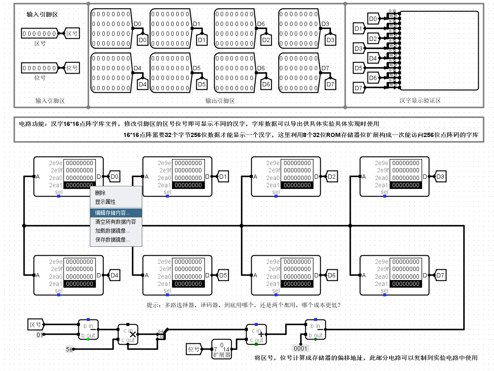
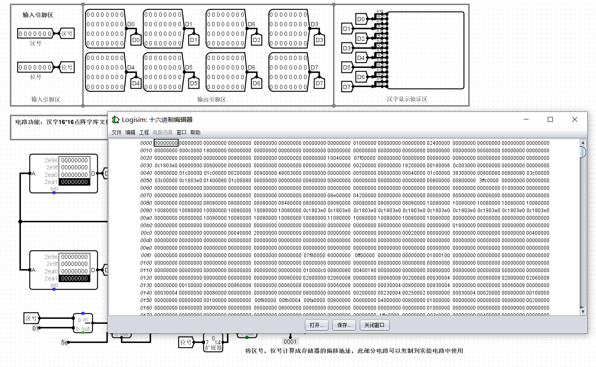
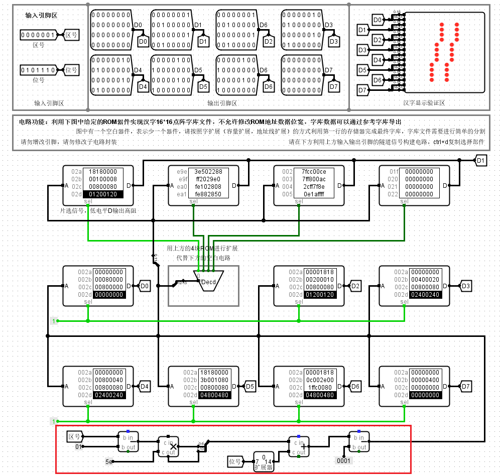
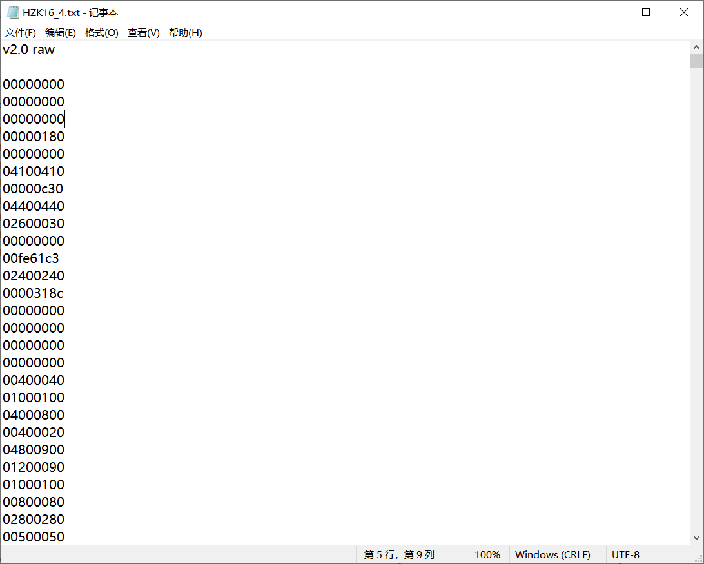
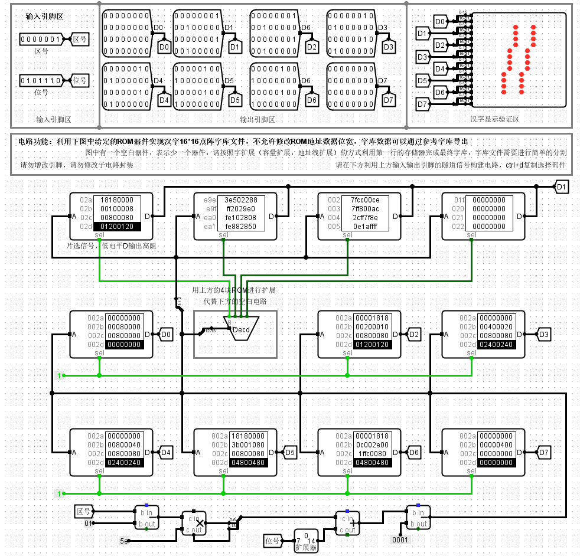
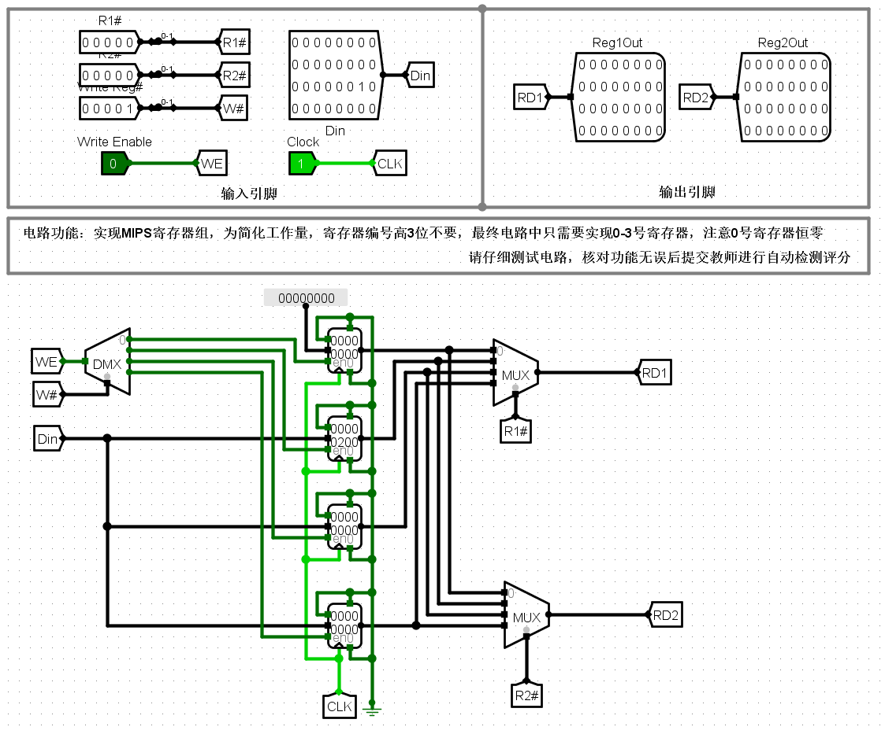

# 实验二：存储系统设计

## 第一关 汉字字库存储芯片扩展实验

这一关要求我们设计一个16\*16点阵的字库模块，大体思路是首先将汉字字形对应的16\*16 LED点阵屏幕输入的数据按一定的规则存储在ROM中，然后根据汉字区位码的编码原理，从区位码得到对应的ROM数据地址，将数据地址输入到ROM中进行寻址输出，最后将字形数据输入到16\*16的LED点阵屏幕输入引脚，完成字库电路。

下面详细讲解一下整个电路的设计思路。

### 16\*16LED点阵屏幕输出汉字的原理

仔细观察图中的LED点阵屏，点阵屏的左侧一共有16个16位输入的引脚，其中每个引脚都分别控制着每一行的每一个点的亮暗，更具体来说，就是每一个引脚输入的16位数据的每一位，控制着该行对应位的亮暗。

举个例子，假设第一个引脚输入0000 0000 0000 0001，那么相应地，第一行地第一个LED就会被点亮，而其它的LED就处于未点亮状态。

因此，如果想要在这一个16\*16的点阵屏幕上显示一个汉字，就必须给出这个汉字对于这个LED屏幕每一行每一位的亮暗状态，也就是由这16个输入引脚构成的16\*16bits = 256bits = 32bytes的数据。

也就是说每一个汉字都对应着一个**32字节的字形数据**，将这32字节的字形数据每2个字节分组，分成16组，将每一组分别输入到LED点阵屏幕的输入引脚，就能显示对应的汉字。

**那么问题来了，每一个汉字对应的32字节字形数据从哪里来呢？**

还好，实验材料中已经给出了16位点阵的字库数据文件，如下图：


也可以在实验材料给的`ZIKU.circ`参考电路的ROM中获取：





### 区位码与字形数据的关系

现在来讲解一下区位码和字形数据的关系，清楚之后就能明白字库ROM的寻址和扩展为何如此设计了。

首先，假设有n个汉字的字形数据，那么这些原始的字形数据是按0\~n-1来编号的（**先暂称其为自然编号**）。

那么每个编号都对应着一个汉字，很显然，这样一来我们只要知道这个汉字对应的**自然编号**就可以通过编号索引到对应的字形数据。

但是我们现在只知道汉字的区位码，如何得到**自然编号**呢？

其实很简单，按照区位码的编号的汉字，从第一个汉字到最后一个汉字的**排列顺序**，其实和**自然编号**的汉字是一致的，我们只是为了方便，人为地对这0\~n-1的汉字按每94个汉字分为一个区，每一个汉字用**区号**和**区内的位号**来加以标识，因此我们只要根据**区位码**计算出**汉字相对于第一个汉字的偏移量**就知道**自然编号**是多少了。

假设一个汉字位于a区b号（**区号位号均从1开始编号**），那么在这个a区前一共有`(a-1)*94`个汉字，那么加上位号b即`(a-1)*94+b`就得到了该汉字是第几个汉字，但由于字形数据是从0开始编号的，我们还要减去一个1，即`(a-1)*94+b-1`，这就是**区位码**对应的**自然编号**。

节选区位码表如下：


那么，现在就可以解释下面的地址生成电路为什么是这样设计的了。



### 如何从ROM中获取对应的字形数据？

假设我们现在只有一个ROM，ROM每个单元是32字节（即256位），按单元进行编址（即每一个地址寻址一个256位数据），我们将n个字形数据存入ROM中，显然，要获取某一个字的字形数据，**只要给出该字的自然编号输入到ROM进行寻址就可以获取了**。

但是在Logisim中没有256位字长的的ROM，因此我们需要使用8个16K*32位字长的ROM进行位扩展，这8个ROM芯片须同时工作，因此片选信号应同时有效，寻址地址长度为14位

其中，第二个16K\*32位字长的ROM芯片用4个4K\*32位字长的ROM芯片进行字扩展替代，这4个芯片在某时刻只有1个在进行工作输出，高14位地址的高2位进行译码片选。

### 数据怎么存？

原始数据应该是像下面这样的（举个例子，数据值不重要）：

```
0x0000_0000_0000_0000_0000_0000_0000_0000_0000_0000_0000_0000_0000_0000_0000_0000 (16个0000,共256位)
0x0000_0000_0000_0000_0000_0000_0000_0000_0000_0000_0000_0000_0000_0000_0000_0001
0x0000_0000_0000_0000_0000_0000_0000_0000_0000_0000_0000_0000_0000_0000_0000_0002
......
......
0x0000_abcd_0000_0000_0000_0000_ffff_0000_0000_0000_0000_0000_0000_0000_0000_0002
```

但我们现在分成了8个ROM芯片，每一个芯片只能存32位字长的数据，于是数据变成了这样：

```
0x0000_0000|0x0000_0000|0x0000_0000|0x0000_0000|0x0000_0000|0x0000_0000|0x0000_0000|0x0000_0000
0x0000_0000|0x0000_0000|0x0000_0000|0x0000_0000|0x0000_0000|0x0000_0000|0x0000_0000|0x0000_0001
0x0000_0000|0x0000_0000|0x0000_0000|0x0000_0000|0x0000_0000|0x0000_0000|0x0000_0000|0x0000_0002
......
......
0x0000_abcd|0x0000_0000|0x0000_0000|0xffff_0000|0x0000_0000|0x0000_0000|0x0000_0000|0x0000_0000
```

每一列分组为一个ROM芯片中的数据，每一个芯片共16K个数据，前后次序不变，只是存储的位序号不同。

下图文件中的数据便是按照上述规则分组后的数据，文件的序号即是ROM芯片的序号。


**注意使用的时候要把前两行去掉。**



其中，第二个ROM使用4个4K\*32位字长的ROM芯片进行字扩展得到，那么这16K个数据应该分成4个4K数据分别存到这4个4K*32位字长的芯片即可。

### 最终电路

按照上面所说的原理，就可以设计出最终的电路。

在拆分数据时，可能需要使用一些工具来进行辅助，如Excel。



## 第二关 MIPS寄存器文件设计

