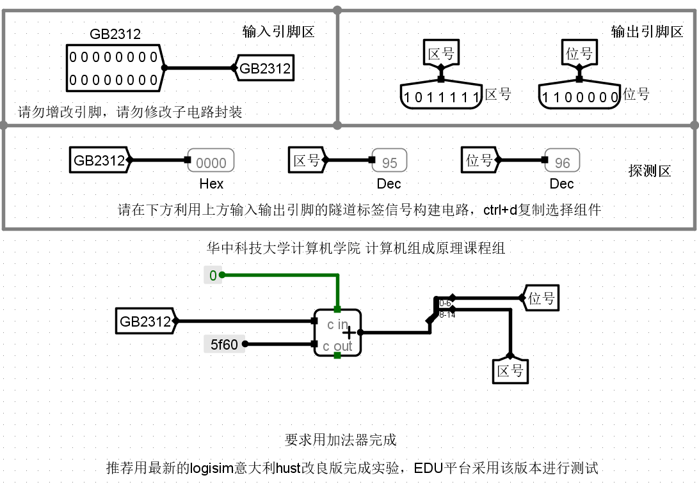
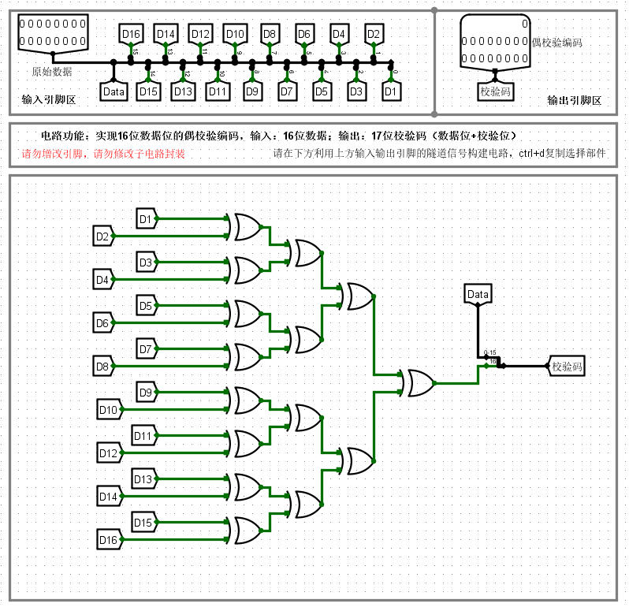
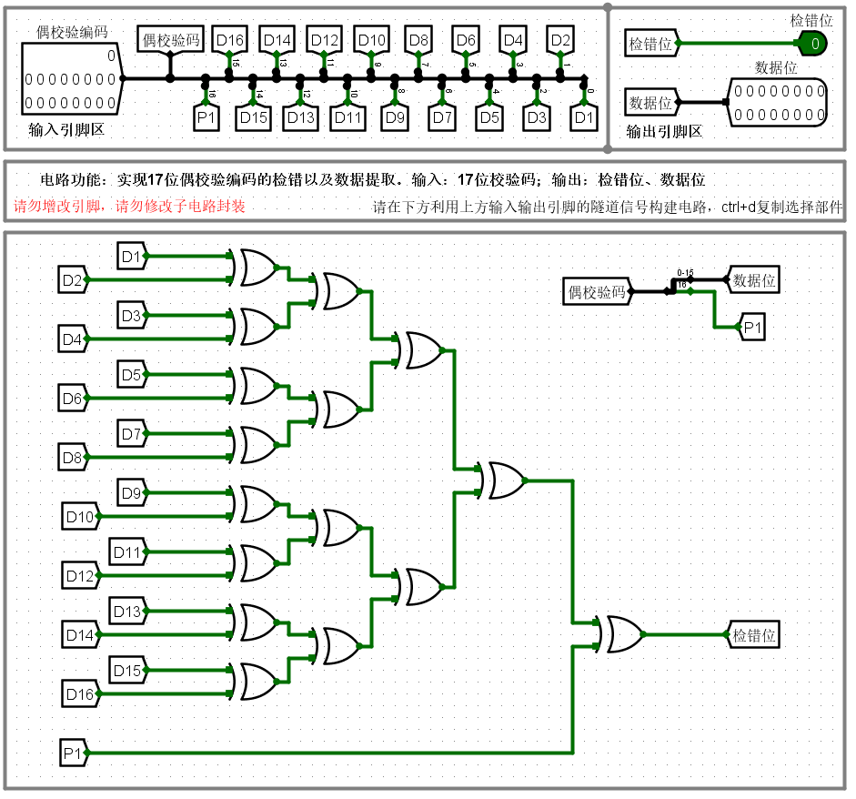
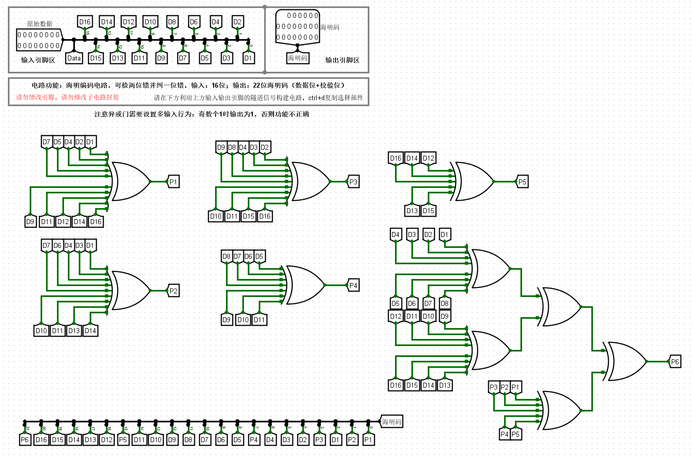
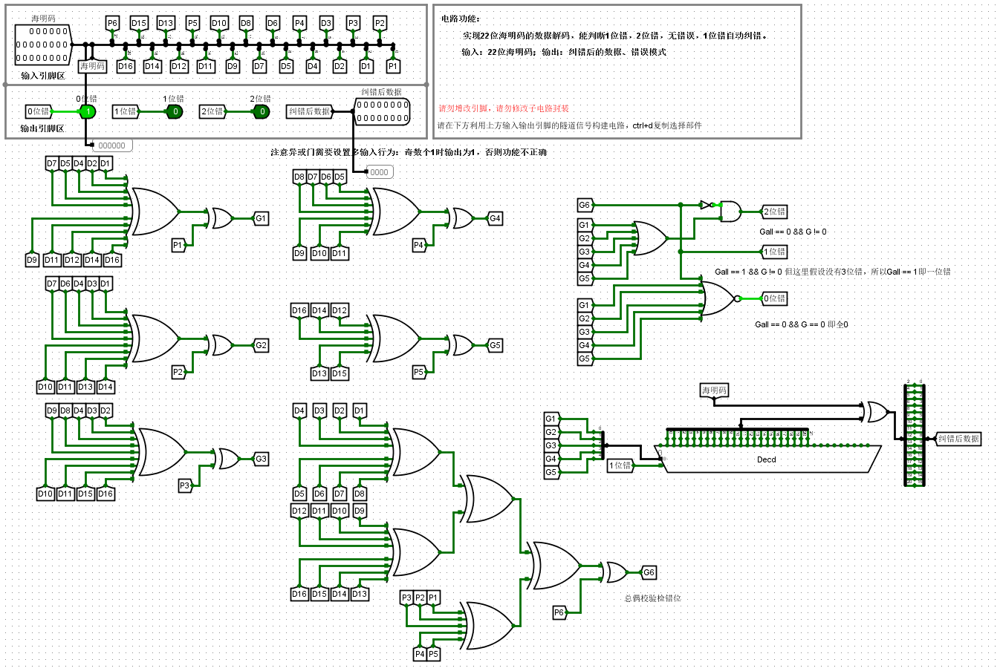
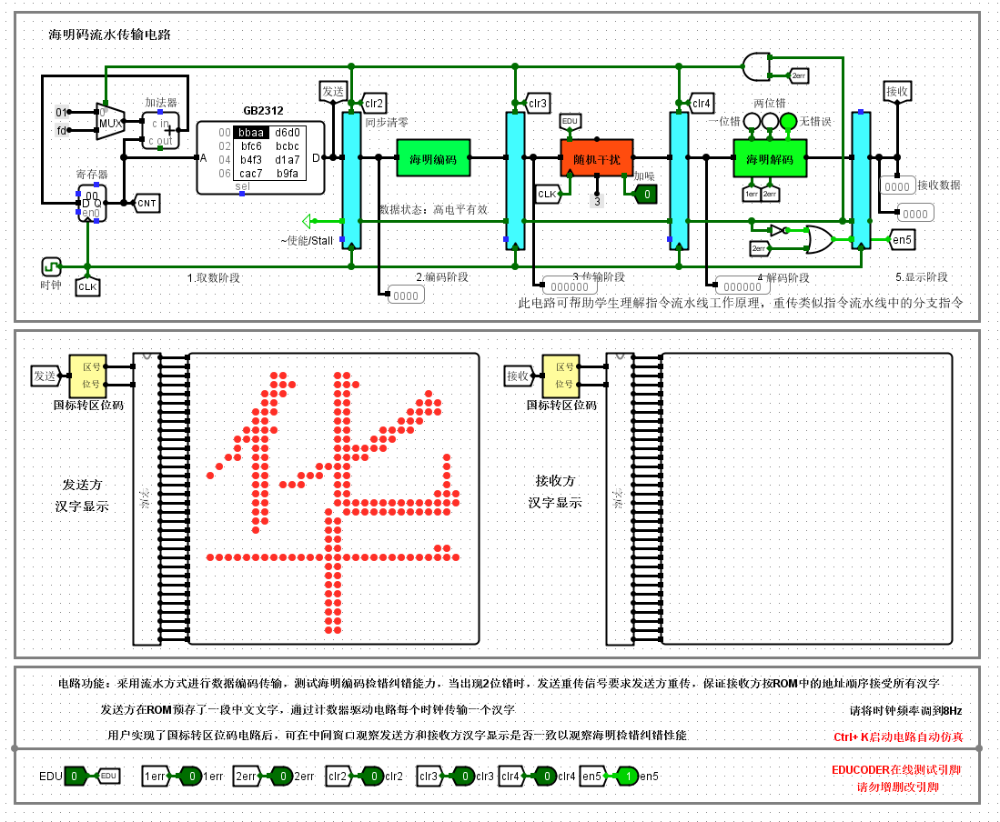

# 实验一：数据表示总结

## 第一关 国标转区位码

这里使用了一个加法器，而区位码+A0A0H=GB2312，要得到区位码，则必须GB2312-A0A0H，那么我们需要手动将A0A0H转成补码，即5F60H，将国标码加上5F60H常量即可（**不可以增加引脚，否则会评测失败**），另外要注意该加法器有一个使能端，低电平有效，因此也要给使能端连接一个低电平常量或者接地信号。

## 第二关 偶校验编码

这里我们只要将数据的每一位相互异或在一起得到一个一位输出，然后通过分线器与原数据形成一个17位的输出即可。

## 第三关 偶校验检错

偶校验编码的检错原理就是，判断接收方通过接受到的数据生成一个偶校验码P'，与发送过来的P进行对比，如果相同，则没有发生错误或者发生了偶数位错，如果不同则发生了1位错或者奇数位错。

检错位为0时没有错误或者发生了偶数位错，检错位为1时发生了1位错或者奇数位错，那么我们可以使用异或来作为输出的逻辑，检错位 = P xor P'，P和P'相同时输出0，不同时输出1。

这里需要注意的是，**右上角的校验码经过分线器分离的最高位要接上P1，否则会评测不通过**，猜测是悬浮态会影响信号的值。

## 第四关 海明编码

16位海明编码的表格如下，具体原理不再赘述，参见教材：

| Code    | H1     | H2     | H3    | H4     | H5    | H6    | H7    | H8     | H9    | H10   | H11   | H12   | H13   | H14   | H15   | H16    | H17   | H18   | H19   | H20   | H21   |
| ------- | ------ | ------ | ----- | ------ | ----- | ----- | ----- | ------ | ----- | ----- | ----- | ----- | ----- | ----- | ----- | ------ | ----- | ----- | ----- | ----- | ----- |
| err/pos | 00001  | 00010  | 00011 | 00100  | 00101 | 00110 | 00111 | 01000  | 01001 | 01010 | 01011 | 01100 | 01101 | 01110 | 01111 | 10000  | 10001 | 10010 | 10011 | 10100 | 10101 |
| map     | **P1** | **P2** | D1    | **P3** | D2    | D3    | D4    | **P4** | D5    | D6    | D7    | D8    | D9    | D10   | D11   | **P5** | D12   | D13   | D14   | D15   | D16   |
| G1      | √      |        | √     |        | √     |       | √     |        | √     |       | √     |       | √     |       | √     |        | √     |       | √     |       | √     |
| G2      |        | √      | √     |        |       | √     | √     |        |       | √     | √     |       |       | √     | √     |        |       | √     | √     |       |       |
| G3      |        |        |       | √      | √     | √     | √     |        |       |       |       | √     | √     | √     | √     |        |       |       |       | √     | √     |
| G4      |        |        |       |        |       |       |       | √      | √     | √     | √     | √     | √     | √     | √     |        |       |       |       |       |       |
| G5      |        |        |       |        |       |       |       |        |       |       |       |       |       |       |       | √      | √     | √     | √     | v     | √     |

| 海明码  | 映射   | 值                                                  |
| ------- | ------ | --------------------------------------------------- |
| **H1**  | **P1** | D1 ⊕ D2 ⊕ D4 ⊕ D5 ⊕ D7 ⊕ D9 ⊕ D11 ⊕ D12 ⊕ D14 ⊕ D16 |
| **H2**  | **P2** | D1 ⊕ D3 ⊕ D4 ⊕ D6 ⊕ D7 ⊕ D10 ⊕ D11 ⊕ D13 ⊕ D14      |
| H3      | D1     |                                                     |
| **H4**  | **P3** | D2 ⊕ D3 ⊕ D4 ⊕ D8 ⊕ D9 ⊕ D10 ⊕ D11 ⊕ D15 ⊕ D16      |
| H5      | D2     |                                                     |
| H6      | D3     |                                                     |
| H7      | D4     |                                                     |
| **H8**  | **P4** | D5 ⊕ D6 ⊕ D7 ⊕ D8 ⊕ D9 ⊕ D10 ⊕ D11                  |
| H9      | D5     |                                                     |
| H10     | D6     |                                                     |
| H11     | D7     |                                                     |
| H12     | D8     |                                                     |
| H13     | D9     |                                                     |
| H14     | D10    |                                                     |
| H15     | D11    |                                                     |
| **H16** | **P5** | D12 ⊕ D13 ⊕ D14 ⊕ D15 ⊕ D16                         |
| H17     | D12    |                                                     |
| H18     | D13    |                                                     |
| H19     | D14    |                                                     |
| H20     | D15    |                                                     |
| H21     | D16    |                                                     |

P6是总偶校验位，由于海明码的各检错位只能判断哪位发生了错误，如果发生了多位错误是无法判断出来的，因此增加了总偶校验位，用来判断数据是否发生了多位错误。

## 第五关 海明解码

首先我们要得到各检错位G，检错位G就是由G对应组的数据位和检错位相异或得到的。

接着我们需要设计判断错误数量的逻辑，逻辑如下（大前提是没有3位及以上错误）：

1. G(all) == 0 && G != 0，有两位错。
2. G(all) == 1 && G != 0，有一位错。
3. G(all) == 0 && G == 0，无错。

最后是有一位错时，需要对错误的数据进行恢复。对于二进制数，错误无非是从0变为1或从1变为0，因此我们只要根据GnGn-1...G1，对错误位进行恢复即可，使其与1异或，0和1与1异或都得到另外一个数。

这里我们可以使用译码器对GnGn-1...G1进行译码（**注意全0时是无错的状态，因此译码的时候不需要，一定要注意这里**），如当GnGn-1...G1=00001时，指的是第一位发生了错误，因此我们要使译码器输出的1与海明码的第一位相异或得到正确的数据。以此类推，因此我们要将译码器输出的1~22位（**第22位无用，只是为了和海明码的位数匹配**）与海明码进行异或，然后使用分线器将数据位分离并输出（**注意要手动选择分线器对应的位属性**）。

## 第六关 海明编码流水传输

这关我们要实现海明码两位出错时的数据重传机制：

1. 发生两位错误时，取指令地址回滚三个地址（因为海明解码阶段前有三个寄存器）。
2. 发生两位错时，前三个寄存器要清零。
3. 发生两位错后，直到正确的数据到来之前，不能让清零的数据进入显示阶段，即要让显示阶段前一个寄存器处于stall状态。

判断海明解码发生两位错的时机的逻辑是：海明解码阶段出现了两位错误且处于数据有效状态，我们可以使用一个与门将海明解码阶段的数据状态与上海明解码模块的两位错输出信号，得到了海明解码发生错误的时机的信号。

第一个功能，我们要用到一个两输入的选择器，当海明解码阶段出现了两位错误且处于数据有效状态时，多路选择器输出FDH（即-3），让指令地址回滚三个地址。

第二个功能，在海明解码发生两位错误时，前三个寄存器要清零，我们将错误信号输入到寄存器的同步清零输入即可。

第三个功能，也就是当海明解码发生两位错时，最后一个寄存器的stall应该输入低电平，此时由于前三个寄存器都清零了，自然数据状态变为低电平，那么在数据状态高电平来临之前，应该使最后一个寄存器的stall处于高电平状态，这里取个非门即可。总结一下，将解码阶段的数据状态取非与上2err信号输入到stall，就实现了这个功能。

