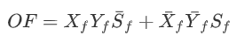
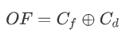
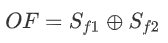
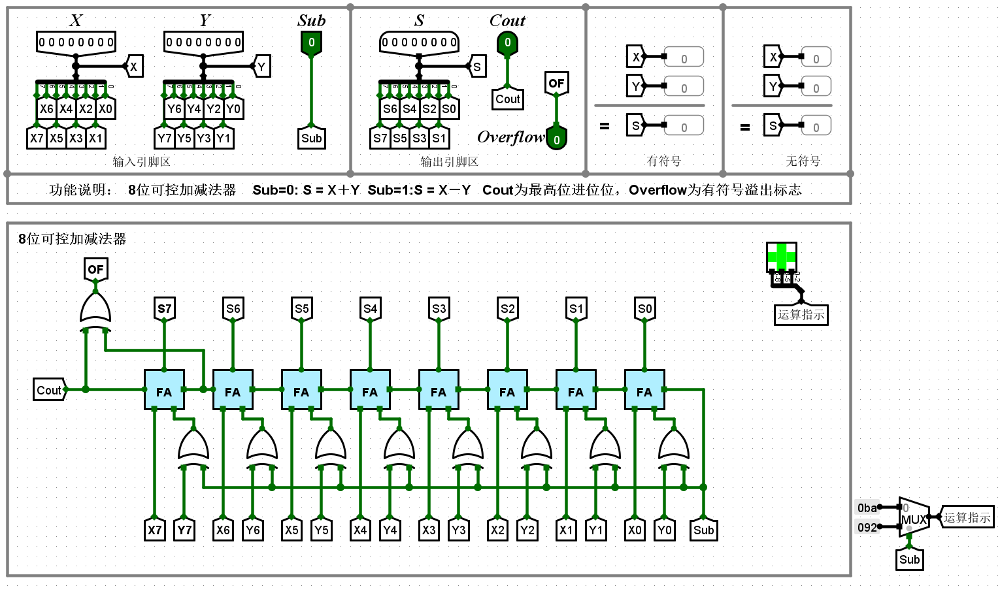
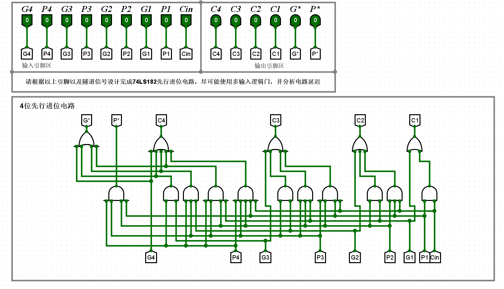
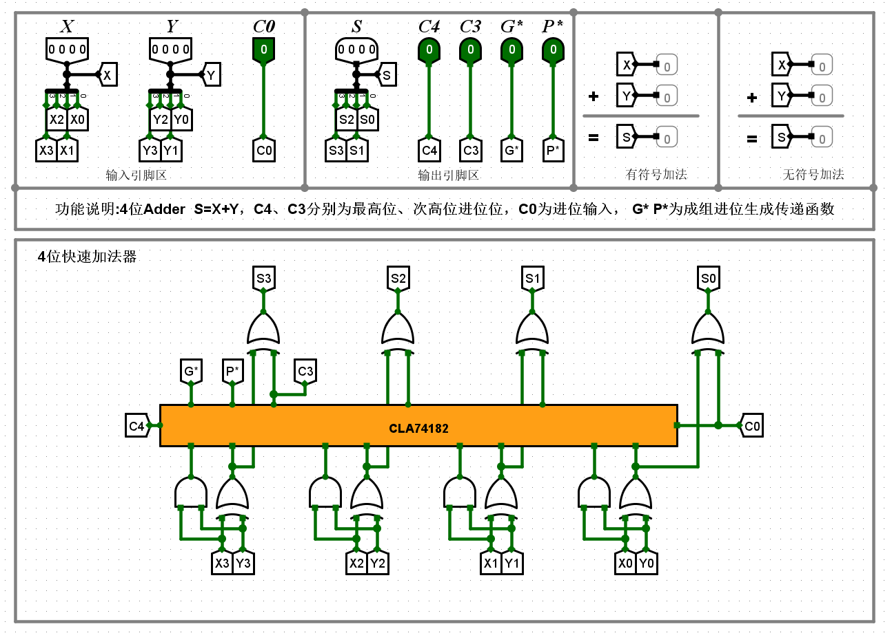
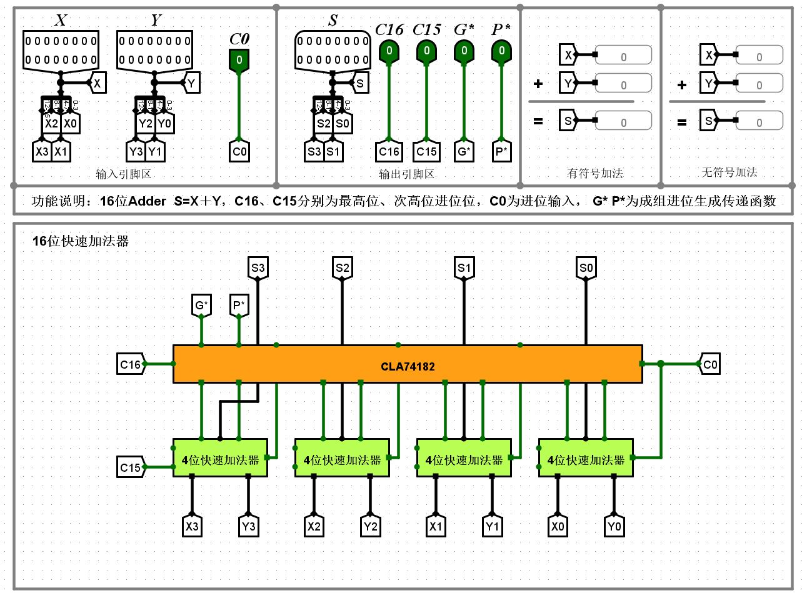
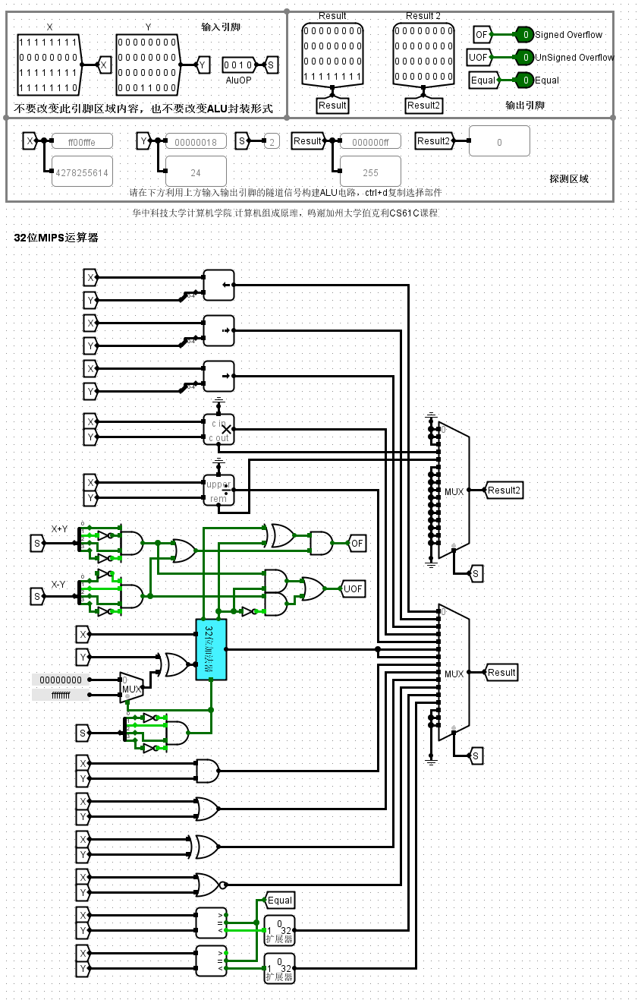

# 实验二：运算器设计（施工中）

## 第一关 8位可控加减法电路设计

这一关需要我们基于已经封装好的全加器设计一个8位的可控加减法电路，并带有溢出检测输出，所谓可控加减法，即当Sub引脚输入高电平时，电路计算结果可以由X+Y变为X+(-Y)。

加减法运算只有在两个操作数符号相同时才会发生溢出，即两个正数相加得到负数，两个负数运算得到正数。

**溢出检测有三种方法**，分别是 ：

①根据操作数的符号位以及运算结果的符号位进行检测，当两个数同号时，得出的结果却是不同号的，则溢出。

②根据最高数据位进位与符号位进位的一致性进行检测，两数为正时，符号位不会产生进位，只有最高数据位有进位时溢出（变为负数）；两数为负时，两数相加符号位一定会产生进位，若此时最高数据没有进位，那么符号位的结果位0，即变为正数，则发生了溢出。

总结一下就是**符号位进位**与**最高数据位进位**必须一致才没有发生溢出。

③使用变形补码的双符号位进行判断。

对于可控加减法的设计，已知输入都是补码，要求我们当Sub引脚输入高电平时，将Y变为其相反数（同样是补码形式）。

## 第二关 CLA182四位先行进位电路设计

## 第三关 4位快速加法器设计

## 第四关 16位快速加法器设计

## 第五关 32位快速加法器设计

## 第十一关 MIPS运算器设计

